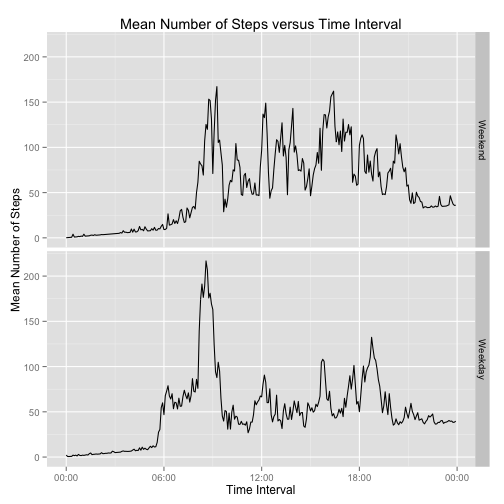

# Reproducible Research: Peer Assessment 1
This analysis requires the plyr, ggplot2, and scales packages. Please ensure that they are installed in your R instance before running this script.


```r
library(plyr)
library(ggplot2)
library(scales)
```

## Loading and preprocessing the data
The data are loaded in the file "activity.csv". We load the data, keeping the `steps` variable as a numeric, and the `interval` variable as an integer. We then cast the `date` field to a `POSIXlt` object.

```r
inData <- read.csv("activity.csv", header = TRUE, colClasses = c("numeric", 
    "character", "integer"))
inData$date <- strptime(inData$date, "%Y-%m-%d")
```

We still need the interval variable represented as a date/time, but the formatting of the data will not allow a direct cast to `POSIXlt`. To fix this, we will pad the number with zeroes to give the `strptime` function a consistent input. It is interesting to note that `strptime` will automatically assign any missing dates as the current day. Because our analysis discards the date information associated with the `POSIXlt` object, this is irrelevant.

```r
inData$interval <- sprintf("%04d", inData$interval)
inData$interval <- strptime(inData$interval, "%H%M")
```

## What is mean total number of steps taken per day?
Answering this question requires two steps: Summing up the steps in each interval for every day, and taking the mean and median of that observation. `ddply` will split the data frame `indata` by values of `date`. Each frame is passed to an anonymous function that takes the sum of the `steps` column, ignoring `NA` values.

```r
stepsPerDay <- ddply(inData, c("date"), function(df) sum(df$steps, na.rm = TRUE))
names(stepsPerDay) <- c("date", "steps")  #Rename the columns
```

Here, we plot a histogram to ensure that the mean and median are representative of the data

```r
qplot(steps, data = stepsPerDay, binwidth = 1600) + xlab("Number of Steps") + 
    ylab("Frequency") + ggtitle("Histogram of Mean Daily Number of Steps")
```

 

We find a bimodal pattern split between 0 steps per day and about 10,000 steps per day. We then evaluate the mean and median

```r
mean(stepsPerDay$steps)
```

```
## [1] 9354
```

```r

median(stepsPerDay$steps)
```

```
## [1] 10395
```

and find that while both measures reasonably approximate the peak at 10,000 steps, the mean is influenced by the other peak at 0 steps.
## What is the average daily activity pattern?
This question is similar to the previous one. Instead of summarizing the mean per day, we are summarizing the mean per 5-minute interval in the original data. Similarly to how this was previously accomplished, `ddply` will process the data split by `interval`, and pass the result to an anonymous function that takes the mean of the `steps` column.

```r
stepsPerInt <- ddply(inData, c("interval"), function(df) mean(df$steps, na.rm = TRUE))
names(stepsPerInt) <- c("interval", "mean")
```

We then plot the results using the ggplot2 system

```r
ggplot(stepsPerInt, aes(interval, mean, group=1)) + # specify the data frame and variables
  geom_line() + # indicate that we want a line plot
  scale_x_datetime(labels = date_format("%H:%M")) + #re-format the x axis labels
  xlab("Time Interval") + # Change the axis and graph names
  ylab("Mean Number of Steps") +
  ggtitle("Mean Number of Steps per Interval")
```

 

We find a large spike at some point in the morning. To find the value of this spike, we use `order` to sort the `mean` column in decreasing order, and return the first value of that list, formatted in 24-hour time.

```r
format(stepsPerInt[order(stepsPerInt$mean, decreasing = TRUE)[1], 1], "%H:%M")
```

```
## [1] "08:35"
```

We find that the 5-minute interval at 08:35 has the largest average steps per day.
## Imputing missing values
First, we find which records are missing data and how many there are

```r
naRecs <- is.na(inData$steps)
sum(naRecs)
```

```
## [1] 2304
```

We impute the missing step values as the mean values for that time interval for the rest of the data set. Because the internal structure of the `POSIXlt` class is not conducive to comparisons,  we cast the intervals first to `POSIXct`, then to `numeric` when comparing values.

```r
naReps <- sapply(as.integer(as.POSIXct(inData[naRecs, "interval"])), FUN = function(ts) which(as.integer(as.POSIXct(stepsPerInt$interval)) == 
    ts))
```

Then, we assign the replacement values to the missing values in the original data frame.

```r
inData$steps[naRecs] <- naReps
```

Lastly, we perform a sanity check to make sure all missing values were replaced.

```r
sum(is.na(inData$steps))
```

```
## [1] 0
```

We now observe the effect this number replacement had on our mean steps per day by replicating the analysis we did above.

```r
stepsPerDay <- ddply(inData, c("date"), function(df) sum(df$steps, na.rm = TRUE))
names(stepsPerDay) <- c("date", "steps")

qplot(steps, data = stepsPerDay, binwidth = 1600) + xlab("Number of Steps") + 
    ylab("Frequency") + ggtitle("Histogram of Mean Daily Number of Steps")
```

 

```r

mean(stepsPerDay$steps)
```

```
## [1] 14812
```

```r
median(stepsPerDay$steps)
```

```
## [1] 11458
```

Examining the histogram, we find that the peak originally located at 0 steps has been moved to about 42000 steps, which is likely an over-representation. Unsurprisingly, we find that the mean has increased significantly from before, whereas the median was relatively unaffected.

## Are there differences in activity patterns between weekdays and weekends?
Our first order of business is to identify both which day of the week each record belongs to, and whether that day is a weekday or weekend. We bind these findings as new columns in the data set.

```r
inData <- cbind(inData, day = weekdays(inData$date))
weekdays <- c("Monday", "Tuesday", "Wednesday", "Thursday", "Friday")
inData <- cbind(inData, (as.character(inData$day) %in% weekdays))
names(inData)[5] <- "isWeekday"
```

Just like before, we split the data by interval and return the mean values. This time, however, we must process weekdays and weekends separately before combining them in a new data frame.

```r
stepsPerWeekDay <- ddply(inData[inData$isWeekday, ], c("interval"), function(df) mean(df$steps))
stepsPerWeekEnd <- ddply(inData[!inData$isWeekday, ], c("interval"), function(df) mean(df$steps))
```

Here, we add a column to identify the data as weekday or weekend, then combine our data into one larger data frame.

```r
stepsPerWeekDay <- cbind(stepsPerWeekDay, isWeekday = 1)
stepsPerWeekEnd <- cbind(stepsPerWeekEnd, isWeekday = 0)
tData <- rbind(stepsPerWeekDay, stepsPerWeekEnd)
```

For the purposes of labeling the graph, we cast the `isWeekday` variable to a factor

```r
tData$isWeekday <- as.factor(tData$isWeekday)
levels(tData$isWeekday) <- c("Weekend", "Weekday")
```

Lastly, we plot the graph.

```r
ggplot(data = tData, aes(interval, V1, group=isWeekday)) +
  geom_line() +
  facet_grid(isWeekday ~. ) +
  xlab("Time Interval") +
  scale_x_datetime(labels = date_format("%H:%M")) +
  ylab("Mean Number of Steps") +
  ggtitle("Mean Number of Steps versus Time Interval")
```

 

We can see a large difference between the weekday and weekend time series; the weekday data have a larger peak in midmorning, whereas the weekend data have higher average activity throughout the rest of the day.
